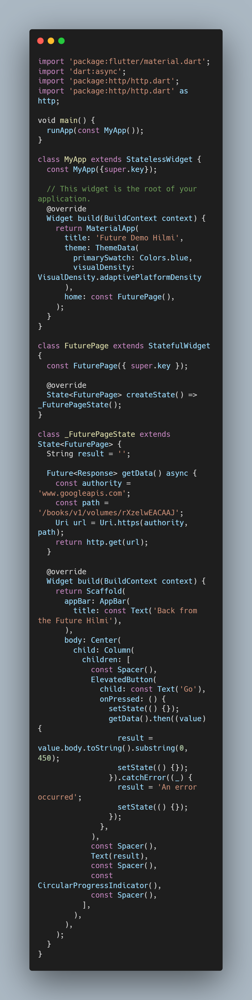
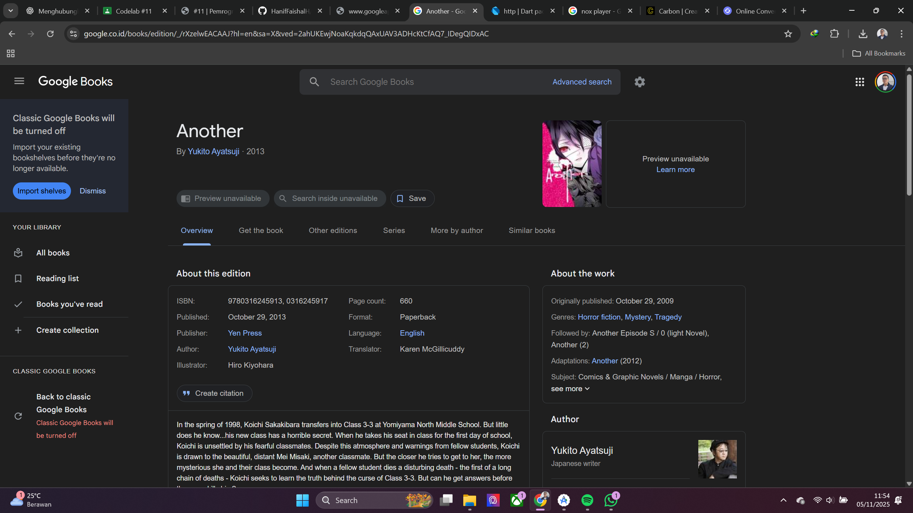
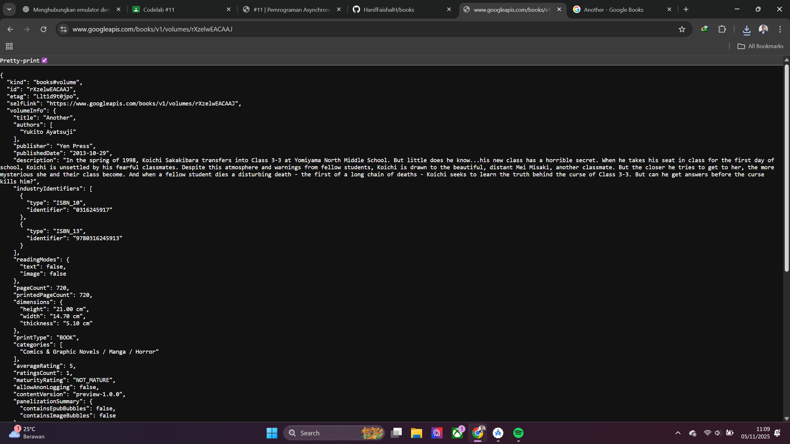
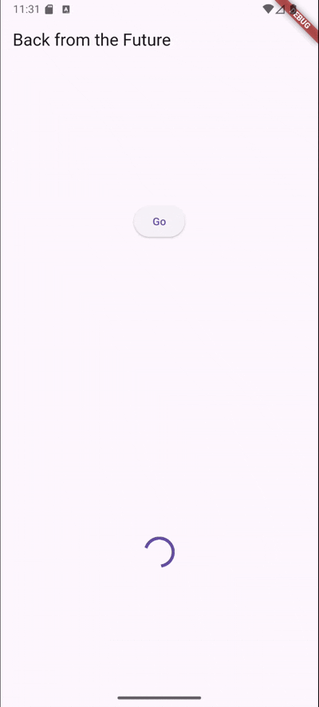
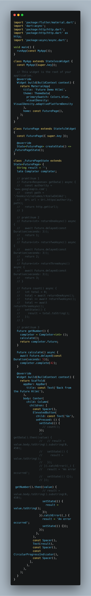
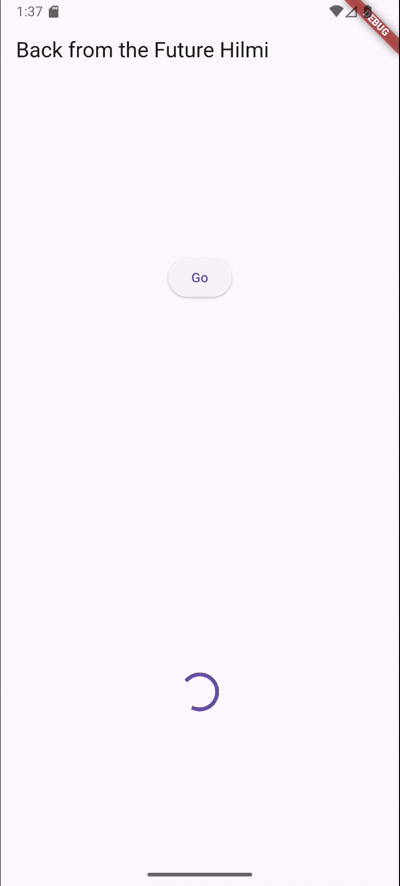

# Pertemuan 11: Pemrograman Asynchronous

**NIM**: 2341720116
**Nama**: Hanif Faishal Hilmi

---

## 📌 Praktikum

### ✅ Praktikum 1: Mengunduh Data dari Web Service (API)

Soal
1. Tambahkan nama panggilan Anda pada title app sebagai identitas hasil pekerjaan Anda.

2. Carilah judul buku favorit Anda di Google Books, lalu ganti ID buku pada variabel path di kode tersebut. Caranya ambil di URL browser Anda seperti gambar berikut ini. Kemudian cobalah akses di browser URI tersebut dengan lengkap seperti ini. Jika menampilkan data JSON, maka Anda telah berhasil. Lakukan capture milik Anda dan tulis di README pada laporan praktikum. Lalu lakukan commit dengan pesan "W11: Soal 2".

3. Jelaskan maksud kode langkah 5 tersebut terkait substring dan catchError!

- subString pada kode ini digunakan untuk mengambil potongan karakter dari indeks 0 sampai 449 (450 karakter pertama).
- catchError digunakan untuk menerima error jika data gagal diambil. Ini dilakukan agar tampilan error tidak muncul di tampilan user.

---

### ✅ Praktikum 2: Menggunakan await/async untuk mengindari callback
Soal

4. Jelaskan maksud kode langkah 1 dan 2 tersebut!

- langkah satu adalah fungsi-fungsi future async yang mengembalikan nilai dengan delay waktu 3 detik.
- langkah kedua adalah fungsi untuk menghitung nilai dari fungsi future diatasnya. Nilai total akan ditambahkan dengan nilai return fungsi async future tiap 3 detik. Oleh karena itu, nilai total akan muncul setelah 9 detik.\

---
### ✅ Praktikum 3: Menggunakan Completer di Future

Soal
5. Jelaskan maksud kode langkah 2 tersebut!

kode tersebut adalah implementasi penggunaan Completer dalam async. Completer adalah objek khusus di Dart yang digunakan untuk mengendalikan kapan sebuah Future dianggap selesai secara manual.

6. Jelaskan maksud perbedaan kode langkah 2 dengan langkah 5-6 tersebut!

Fungsi pada langkah 2 (calculate()) tidak ada penanganan error. Ketika ada error, Future bisa menggantung selamanya. Stabilitas kode kurang aman, dan lebih tinggi kemungkinan crash.

Fungsi pada langkah 5-6 (calculate2()) ada try-catch yang dapat memperkecil kemungkinan crash dan menjalankan completeError() jika ada respon error.

---

### ✅ Praktikum 4: Memanggil Future secara Paralel

Soal

7. 

8. Kode pertama berasal dari package async, sedangkan kode kedua adalah Built-in Dart. Futurenya bisa ditambahkan sebelum .Close() dan fungsi ini wajib dipanggil, sedangkan kode kedua semua Future harus ada. Error handlingnya kode pertama lebih mudah dibanding kode kedua. Kode pertama lebih panjang, cocok untuk Jumlah Future tidak pasti, sedangkan Kode kedua lebih pendek, cocok untuk jumlah Future yang sudah pasti.

---

### ✅ Praktikum 5: Menangani Respon Error pada Async Code

Soal
9. Capture hasil praktikum Anda berupa GIF dan lampirkan di README. Lalu lakukan commit dengan pesan "W11: Soal 9".

10. Panggil method handleError() tersebut di ElevatedButton, lalu run. Apa hasilnya? Jelaskan perbedaan kode langkah 1 dan 4!

- kode pertama structurnya lebih nested, tiap .then() dieksekusi berurutan, penangkapan error menggunakan .catchError(), dan ditutup dengan .whenComplete().

- kode kedua lebih linear, flow kode seperti biasa, penangkapan error menggunakan catch, dan ditutup dengan finally().

---

### ✅ Praktikum 6: Menggunakan Future dengan StatefulWidget

